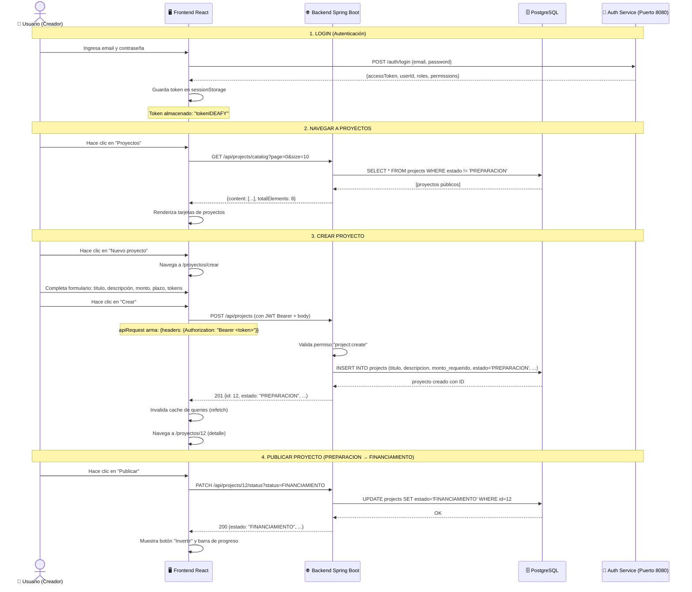
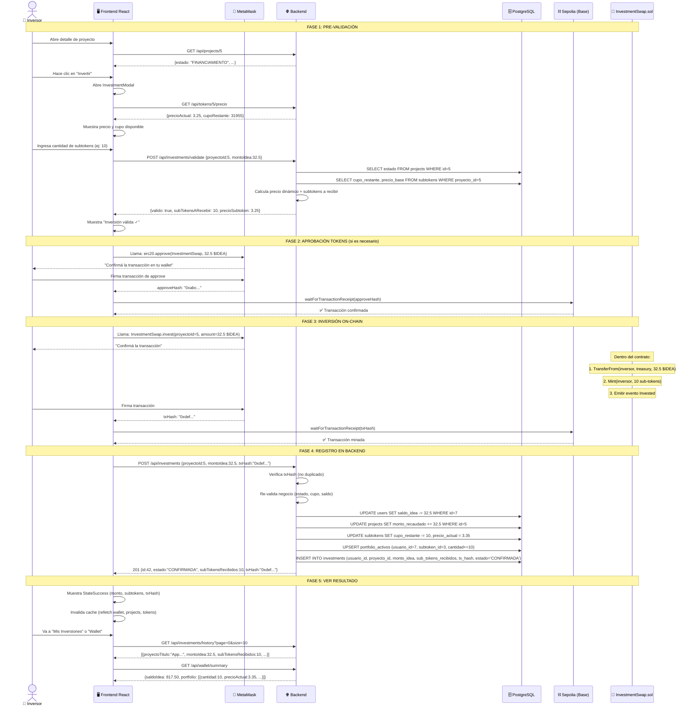
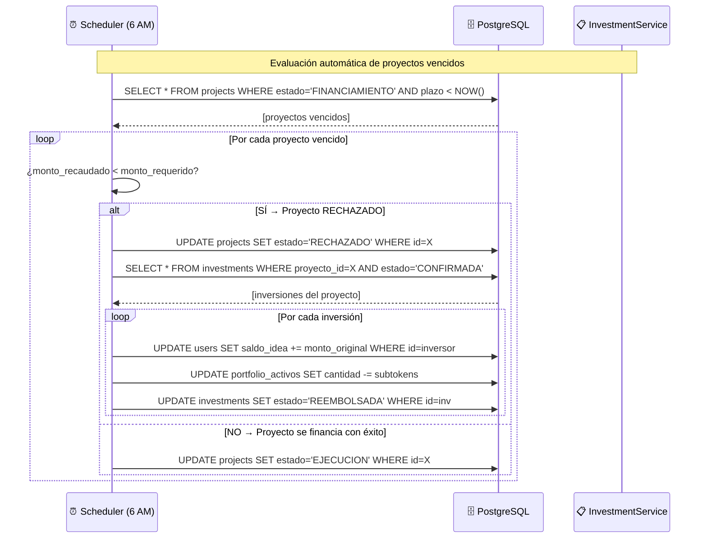
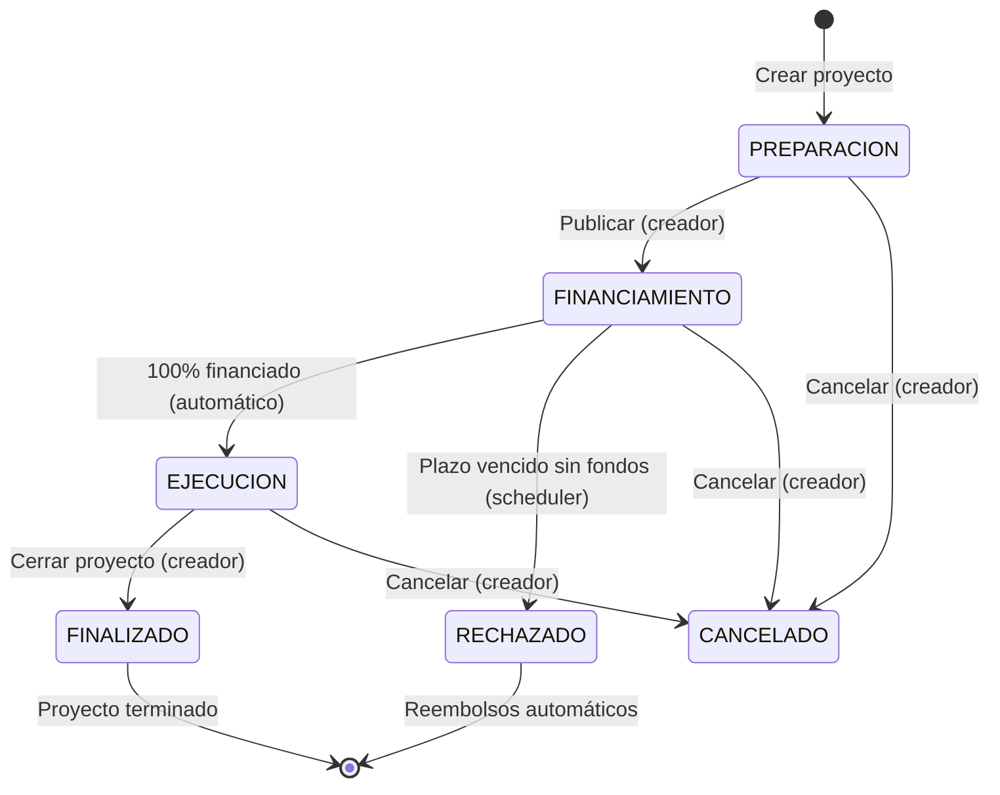

# 🎬 Guion de Demo — Systeam: Plataforma de Crowdfunding Tokenizado

## Índice
1. [Arquitectura general](#1-arquitectura-general)
2. [Diagramas de flujo Mermaid](#2-diagramas-de-flujo-mermaid)
3. [Smart Contracts — Explicación detallada](#3-smart-contracts)
4. [Guion paso a paso — Crear proyecto](#4-guion-paso-a-paso--crear-proyecto)
5. [Guion paso a paso — Inversión](#5-guion-paso-a-paso--inversión)
6. [Preguntas frecuentes y posibles preguntas de la mesa](#6-preguntas-frecuentes-y-posibles-preguntas-de-la-mesa)

---

## 1. Arquitectura General

El sistema tiene **3 capas** bien diferenciadas:

```
┌─────────────────────────────────────────────────────────────────┐
│                      FRONTEND (React + Vite)                    │
│                                                                  │
│  ┌──────────┐  ┌──────────┐  ┌────────────┐  ┌──────────────┐  │
│  │  Páginas  │  │   Hooks  │  │  api-client │  │  Web3 (Wagmi)│  │
│  │  (React)  │──│ (Query)  │──│  (fetch)    │  │  (RainbowKit)│  │
│  └──────────┘  └──────────┘  └──────┬───────┘  └──────┬───────┘  │
│                                      │                  │          │
└──────────────────────────────────────┼──────────────────┼──────────┘
                                       │ HTTP REST       │ Blockchain RPC
                                       ▼                  ▼
┌──────────────────────────────────────────────────────────────────┐
│                    BACKEND (Spring Boot)                         │
│                                                                   │
│  ┌──────────────┐  ┌──────────────┐  ┌───────────────────────┐   │
│  │  Controllers  │  │   Services   │  │  BlockchainService    │   │
│  │  (REST API)   │──│ (Business    │──│  (Web3j - Sepolia)    │   │
│  │               │  │  Logic)      │  │                       │   │
│  └──────────────┘  └──────┬───────┘  └──────────┬────────────┘   │
│                            │                      │               │
│                            ▼                      │               │
│                     ┌──────────────┐              │               │
│                     │  PostgreSQL   │              │               │
│                     │  (JDBC/Flyway)│              │               │
│                     └──────────────┘              │               │
└───────────────────────────────────────────────────┼───────────────┘
                                                     │
                                                     ▼
                          ┌──────────────────────────────────────────┐
                          │          SEPOLIA (Blockchain)            │
                          │                                          │
                          │  InvestmentSwap.sol (Contrato principal)  │
                          │  ProjectToken.sol (ERC-20 por proyecto)   │
                          │  PaymentGateway.sol (Pagos en USDC)       │
                          │  TokenFactory.sol (Factory de tokens)      │
                          └──────────────────────────────────────────┘
```

### Stack tecnológico

| Capa | Tecnología | Propósito |
|------|-----------|-----------|
| **Frontend** | React + Vite | UI interactiva |
| | Wagmi + RainbowKit | Conexión a wallet (MetaMask) |
| | TanStack Query | Cache y sincronización de datos |
| | Tailwind CSS | Estilos |
| **Backend** | Spring Boot 3.3.5 | API REST |
| | PostgreSQL | Persistencia transaccional |
| | Flyway | Migraciones de DB versionadas |
| | Web3j 4.12.3 | Comunicación con Ethereum |
| | JWT + Spring Security | Autenticación y autorización |
| **Blockchain** | Solidity 0.8.20 | Smart contracts |
| | Foundry | Desarrollo y test de contratos |
| | Base Sepolia | Testnet donde están deployados |
| | OpenZeppelin | Librerías estándar ERC-20 |

---

## 2. Diagramas de Flujo en Mermaid

### 2.1 Flujo completo: Creación de Proyecto



### 2.2 Flujo completo: Inversión (con blockchain)



### 2.3 Flujo de Reembolso Automático (Proyecto Rechazado)



### 2.4 Diagrama de Estados del Proyecto



---

## 3. Smart Contracts — Explicación Detallada

### 3.1 InvestmentSwap.sol — El corazón del sistema

```solidity
contract InvestmentSwap is Ownable, ReentrancyGuard {
    IERC20 public immutable idea;           // Token $IDEA (ERC-20)
    address public immutable treasury;      // Cuenta que recibe los fondos
    mapping(uint256 => address) public tokenDeProyecto;  // proyectoId → tokenAddress

    function invest(proyectoId, ideaAmount, subTokenAmount, investor) external
    function refund(proyectoId, subTokenAmount, holder, investor) external onlyOwner
    function crearTokenProyecto(proyectoId, nombre, simbolo, supplyInicial) external onlyOwner
}
```

**¿Qué hace este contrato?**

Es un **swap descentralizado** que intercambia tokens $IDEA por sub-tokens de proyecto en una sola transacción atómica. Está deployado en **Base Sepolia**.

**Funciones clave:**

| Función | ¿Quién la llama? | ¿Qué hace? |
|---------|-----------------|------------|
| `invest()` | El frontend vía MetaMask del inversor | Transfiere $IDEA del inversor al treasury, y mintea sub-tokens al inversor |
| `refund()` | Solo el owner (back-end) | Quema sub-tokens del holder (devolución) |
| `crearTokenProyecto()` | Solo el owner (back-end) | Despliega un nuevo ProjectToken para un proyecto |

**El flujo `invest()` paso a paso:**

1. Valida que `ideaAmount > 0` y `subTokenAmount > 0`
2. Verifica que exista un token asociado al proyecto
3. Ejecuta `idea.transferFrom(msg.sender, treasury, ideaAmount)` — mueve $IDEA del inversor al treasury
4. Ejecuta `ProjectToken(projectTokenAddr).mint(investor, subTokenAmount)` — crea sub-tokens nuevos y se los asigna al inversor
5. Emite el evento `InvestmentMade` para que cualquiera pueda auditar la transacción

**¿Por qué es necesario este contrato?**
- **Atomicidad**: La transferencia de $IDEA y la creación de sub-tokens ocurren en la MISMA transacción. Si una falla, todo falla. No hay riesgo de que el inversor pague y no reciba sus tokens.
- **Transparencia**: Cualquier persona puede ver en el explorador de bloques cuánto se invirtió y en qué proyecto.
- **Inmutabilidad**: Una vez registrada, la inversión no puede ser modificada por nadie.

### 3.2 ProjectToken.sol — Token ERC-20 por proyecto

```solidity
contract ProjectToken is ERC20, Ownable {
    uint256 public constant TASA_QUEMA = 10;  // 0.1% (10/10000)

    function mint(para, cantidad) external onlyOwner
    function burnFrom(desde, cantidad) external onlyOwner

    function _update(desde, para, valor) internal override {
        // Aplica 0.1% de quema en cada transferencia
        uint256 cantidadAQuemar = (valor * TASA_QUEMA) / 10000;
        _burn(desde, cantidadAQuemar);  // Quema el 0.1%
        super._update(desde, para, valor - cantidadAQuemar);
    }
}
```

**¿Qué lo hace especial?**

Cada proyecto tiene **su propio token ERC-20**. Esto significa:
- El token del proyecto "App de gestión" es diferente al token del proyecto "Plataforma AI"
- Los inversores reciben estos tokens como representación de su participación
- **Tasa de quema del 0.1%**: Cada vez que se transfiere un sub-token, el 0.1% se destruye (burn). Esto crea escasez y puede aumentar el valor de los tokens restantes con el tiempo.

**Ejemplo de la tasa de quema:**
- Inversor A tiene 1000 sub-tokens del Proyecto X
- Vende 100 sub-tokens al Inversor B
- El Inversor B recibe 99.9 sub-tokens (100 - 0.1%)
- 0.1 sub-tokens se queman (destruyen permanentemente)

### 3.3 TokenFactory.sol — Fábrica de tokens

```solidity
contract TokenFactory {
    address public immutable treasury;
    mapping(uint256 => address) public tokenDeProyecto;
    address[] public tokensCreados;

    function crearTokenProyecto(proyectoId, nombre, simbolo, supplyInicial) external returns (address)
}
```

**¿Para qué sirve?**

Es un **factory pattern**: cuando se crea un proyecto en estado FINANCIAMIENTO, el backend llama a `crearTokenProyecto()` que despliega automáticamente un nuevo contrato `ProjectToken` con el nombre y símbolo del proyecto.

**Beneficio**: No hay que deployar contratos manualmente por cada proyecto. Todo es automático.

### 3.4 PaymentGateway.sol — Pagos en USDC

```solidity
contract PaymentGateway is Ownable {
    IERC20 public immutable usdc;
    address public treasury;

    function pay(amount, actionId) external
    function withdraw(amount) external onlyOwner
}
```

**¿Para qué sirve?**
Para el sistema de **Boost** (destacar proyectos). El creador paga 100 USDC para destacar su proyecto por 7 días. El pago va al treasury de la plataforma.

### Resumen de contratos deployados en Sepolia

| Contrato | Red | Propósito |
|----------|-----|-----------|
| **InvestmentSwap** | Base Sepolia | Swap atómico $IDEA ↔ sub-tokens |
| **$IDEA Token** | Base Sepolia | Token ERC-20 interno de la plataforma |
| **PaymentGateway** | Base Sepolia | Pagos en USDC (para boosts) |
| **ProjectToken** | Base Sepolia | ERC-20 único por proyecto (desplegado via factory) |

---

## 4. Guion Paso a Paso — Crear Proyecto

### Escena 1: Login

**🎭 Lo que ve el usuario:**
La pantalla de login con email y contraseña.

**🎬 Acción del presentador:**
"Iniciamos sesión como creador. Ingreso mis credenciales y hago clic en 'Ingresar'."

**⚙️ Lo que pasa en el frontend:**

```javascript
// Frontend: LoginPage.jsx
fetch('http://localhost:8080/auth/login', {
  method: 'POST',
  body: JSON.stringify({ email, password })
})
.then(res => res.json())
.then(data => {
  sessionStorage.setItem('tokenIDEAFY', data.accessToken)
  sessionStorage.setItem('refreshTokenIDEAFY', data.refreshToken)
  sessionStorage.setItem('userIdIDEAFY', data.userId)
  // Redirige al dashboard
})
```

**⚙️ Lo que pasa en el backend:**

1. Auth Service recibe las credenciales
2. Valida contra PostgreSQL
3. Genera un **JWT** (JSON Web Token) firmado con el rol y permisos del usuario
4. Devuelve: `{accessToken, refreshToken, userId, roles, permissions}`

**🤔 Posible pregunta: "¿Cómo se protegen las rutas?"**

> El frontend guarda el token en `sessionStorage`. Cada request al backend incluye `Authorization: Bearer <token>`. El backend tiene un filtro (`TokenValidationFilter`) que verifica la firma del JWT en cada request. Si el token expiró, usa el `refreshToken` para obtener uno nuevo automáticamente (el `api-client.js` maneja esto con un patrón de retry).

---

### Escena 2: Catálogo de Proyectos

**🎭 Lo que ve el usuario:**
Lista de proyectos con filtros, búsqueda, y tarjetas con progreso de financiamiento.

**🎬 Acción del presentador:**
"Acá vemos el catálogo de proyectos. Hay filtros por estado, rango de monto, ordenamiento, y proyectos destacados."

**⚙️ Lo que pasa en el frontend:**

```javascript
// useProjects.js — TanStack Query
useQuery({
  queryKey: ['projects', 'list', { page: 0, size: 10 }],
  queryFn: () => apiRequest('/api/projects/catalog', { params: { page: 0, size: 10 }})
})
```

**⚙️ Lo que pasa en el backend:**

```sql
-- ProjectService.java
SELECT id, titulo, descripcion, estado, monto_requerido, monto_recaudado,
       plazo, creado_en, es_destacado
FROM projects
WHERE (estado IS NULL OR estado = :estado)  -- filtro opcional
  AND (estado != 'PREPARACION')             -- no se ven proyectos en preparación
ORDER BY creado_en DESC
LIMIT 10 OFFSET 0
```

**🤔 Posible pregunta: "¿Qué son los proyectos destacados?"**

> Los proyectos destacados aparecen primero en el listado. El creador paga 100 $IDEA para destacar su proyecto por 7 días. Es un sistema de visibilidad.

---

### Escena 3: Creación de Proyecto

**🎭 Lo que ve el usuario:**
Formulario con: título, descripción, monto requerido, plazo (calendario), gobernanza comunitaria (toggle), cupo máximo de tokens, valor nominal del token.

**🎬 Acción del presentador:**
"Vamos a crear un proyecto nuevo. Llenamos los campos: 'App de gestión inteligente', descripción, $10,000 de meta, plazo de 3 meses."

**⚙️ Lo que pasa en el frontend:**

```javascript
// project-editor.jsx — ProjectForm
const createProject = useCreateProject()
const handleSubmit = async (data) => {
  const p = await createProject.mutateAsync(data)
  navigate(`/proyectos/${p.id}`)  // Redirige al detalle
}

// useCreateProject() — usa TanStack Query mutation
useMutation({
  mutationFn: (data) => apiRequest('/api/projects', {
    method: 'POST',
    body: {
      titulo: data.titulo,
      descripcion: data.descripcion,
      montoRequerido: data.montoRequerido,
      plazo: data.plazo,
      gobernanzaComunidad: data.gobernanzaComunidad,
      cupoMaximoTokens: data.cupoMaximoTokens,
      valorNominalToken: data.valorNominalToken
    }
  }),
  onSuccess: () => {
    queryClient.invalidateQueries(['projects'])  // Refresca el listado
    toast.success('Proyecto creado exitosamente')
  }
})
```

**⚙️ Lo que pasa en el backend:**

```java
// ProjectService.java
@Transactional
public ProjectResponse createProject(CreateProjectRequest request, Long usuarioId) {
    // 1. Valida permisos: el usuario debe tener "project:create"
    // 2. Valida campos: título obligatorio, monto > 0, etc.
    // 3. Inserta en DB
    String sql = "INSERT INTO projects (titulo, descripcion, monto_requerido, plazo, ...) " +
                 "VALUES (?, ?, ?, ?, ...) RETURNING id";
    Long id = jdbc.queryForObject(sql, Long.class, ...);

    // 4. Crea el subtoken asociado (necesario para inversión)
    String subtokenSql = "INSERT INTO subtokens (proyecto_id, nombre, cupo_restante, " +
                         "suministro_total, precio_base, factor_volatilidad) " +
                         "VALUES (?, ?, ?, ?, ?, ?)";
    jdbc.update(subtokenSql, id, request.getTitulo(), request.getCupoMaximoTokens(),
                request.getCupoMaximoTokens(), request.getValorNominalToken(), 1.0);

    return buildResponse(id);
}
```

**🤔 Posible pregunta: "¿Por qué el proyecto arranca en PREPARACION?"**

> PREPARACIÓN es un estado editable donde solo el creador ve el proyecto. No está público. Permite ajustar detalles antes de publicarlo. Una vez que pasa a FINANCIAMIENTO, el creador ya no puede editarlo (solo cancelarlo).

---

### Escena 4: Publicar Proyecto

**🎭 Lo que ve el usuario:**
Botón "Publicar" que cambia el estado a "En Financiamiento".

**🎬 Acción del presentador:**
"Una vez que el proyecto está listo, hacemos clic en 'Publicar'. El proyecto pasa a estar visible para inversores."

**⚙️ Lo que pasa en el frontend:**

```javascript
// project-detail.jsx
const transitionTo = async (status) => {
  await updateStatus.mutateAsync({ id: projectId, status: 'FINANCIAMIENTO' })
  toast.success('Proyecto publicado exitosamente')
  refetch()  // Recarga los datos del proyecto
}
```

**⚙️ Lo que pasa en el backend:**

```java
// ProjectService.java
@Transactional
public ProjectResponse updateStatus(Long id, String newStatus, Long usuarioId) {
    // 1. Lee el proyecto actual
    Project project = findById(id);
    // 2. Valida transición: PREPARACION → FINANCIAMIENTO
    validateTransition(project.getEstado(), newStatus);
    // 3. Si pasa a FINANCIAMIENTO, crea el token on-chain
    if ("FINANCIAMIENTO".equals(newStatus)) {
        smartContractService.deployProjectToken(id, project.getTitulo(), ...);
    }
    // 4. Actualiza estado en DB
    jdbc.update("UPDATE projects SET estado = ? WHERE id = ?", newStatus, id);
}
```

**🤔 Posible pregunta: "¿Qué pasa con el smart contract cuando se publica?"**

> El backend llama a `SmartContractService.deployProjectToken()` que ejecuta `InvestmentSwap.crearTokenProyecto()` en Sepolia. Esto deploya un nuevo contrato `ProjectToken` con el nombre del proyecto y su supply inicial. El address del nuevo token se guarda en la tabla `projects` para referencia futura. Este paso es **transparente para el usuario**.

**⚠️ IMPORTANTE para la demo**: Si no hay conexión a Sepolia, el backend tiene un **fallback**: registra la info solo en DB. El sistema nunca se cae por un problema de blockchain.

---

## 5. Guion Paso a Paso — Inversión

### Escena 5: Detalle del Proyecto

**🎭 Lo que ve el usuario:**
Página de detalle con: título, descripción, barra de progreso (monto recaudado / monto requerido), métricas (monto, plazo, cupo tokens), y botón "Invertir".

**🎬 Acción del presentador:**
"Acá vemos el proyecto ya publicado. Se ve el progreso de financiamiento, la barrita violeta que muestra cuánto se recaudó. Arriba a la derecha, el botón 'Invertir' para los inversores."

**⚙️ Lo que pasa en el frontend:**

```javascript
// project-detail.jsx
const { data: project, isLoading } = useProject(projectId)
const canInvest = isInvestor && project.estado === 'FINANCIAMIENTO'

// Consulta información del token on-chain
const fetchTokenInfo = async () => {
  const res = await apiRequest(API_ENDPOINTS.TOKENS_BY_PROJECT(projectId))
  setTokenInfo(res)
}

// Cuando el proyecto cambia a FINANCIAMIENTO, busca datos del token
useEffect(() => {
  if (project?.estado === 'FINANCIAMIENTO') fetchTokenInfo()
}, [project?.id, project?.estado])
```

---

### Escena 6: Inversión — Paso 1 (Pre-validación)

**🎭 Lo que ve el usuario:**
Modal de inversión con:
- Conexión a MetaMask
- Precio actual del sub-token
- Cupo disponible (barra de progreso)
- Input para cantidad de sub-tokens
- Botones rápidos (1, 5, 10, 50 sub-tokens)
- Validación en tiempo real

**🎬 Acción del presentador:**
"Nos conectamos con MetaMask. Acá vemos el precio actual del sub-token: $3.25. Voy a comprar 10 sub-tokens. El frontend automáticamente valida contra el backend si la inversión es posible."

**⚙️ Lo que pasa en el frontend (cada vez que el usuario escribe):**

```javascript
// investment-modal.jsx
const { data: tokenPrice } = useTokenPrice(projectId)

// Cada vez que cambia el input, se valida
useEffect(() => {
  if (effectiveAmount && projectId) {
    validateMutation.mutate({ proyectoId: projectId, montoIdea: effectiveAmount })
  }
}, [effectiveAmount, projectId])
```

**⚙️ Lo que pasa en el backend:**

```java
// InvestmentService.java
public ValidateInvestmentResponse validateInvestment(ValidateInvestmentRequest request) {
    // 1. Busca proyecto ¿existe?
    // 2. ¿Estado = FINANCIAMIENTO?
    // 3. ¿Tiene subtoken asociado?
    // 4. Calcula PRECIO DINÁMICO:
    //    precio = precioBase x (1 + (suministroTotal - cupoRestante) / suministroTotal x factorVolatilidad)
    //    A menor cupo restante → mayor precio (oferta y demanda)
    // 5. Calcula sub-tokens: piso(monto / precioSubtoken)
    // 6. Valida que reciba al menos 1 sub-token
    // 7. Valida que no supere el cupo disponible
    return ValidateInvestmentResponse.builder()
        .valido(true)
        .subTokensARecebir(10)
        .precioSubtoken(new BigDecimal("3.25"))
        .cupoDisponible(31955)
        .build();
}
```

**🤔 Posible pregunta: "¿Cómo funciona el precio dinámico?"**

> Usamos un modelo que simula oferta y demanda:
>
> ```
> precioDinamico = precioBase × (1 + (tokensVendidos / suministroTotal) × factorVolatilidad)
> ```
>
> - **precioBase**: Lo define el creador (ej: $10)
> - **tokensVendidos**: Cuántos sub-tokens se compraron ya
> - **suministroTotal**: El cupo máximo definido
> - **factorVolatilidad**: Qué tan rápido sube el precio (default: 1.0)
>
> Ejemplo: Si el precioBase es $10, el suministro es 1000, y se vendieron 500:
> `precio = 10 × (1 + (500/1000) × 1.0) = 10 × 1.5 = $15`
>
> Esto incentiva a **invertir temprano** (más barato) y recompensa a los early adopters.

---

### Escena 7: Inversión — Paso 2 (Aprobación en MetaMask)

**🎭 Lo que ve el usuario:**
Ventana de MetaMask pidiendo "Approve $IDEA spending". Muestra el monto a aprobar y el contrato destino.

**🎬 Acción del presentador:**
"El frontend detecta que el contrato InvestmentSwap necesita permiso para gastar nuestros $IDEA. Aparece MetaMask pidiendo que firmemos la aprobación. Esto solo pasa la primera vez que invertimos en un proyecto (o si cambió el monto)."

**⚙️ Lo que pasa:**

```javascript
// investment-modal.jsx
const { data: allowance } = useReadContract({
  address: VITE_IDEA_TOKEN_ADDRESS,
  abi: ERC20_ABI,
  functionName: 'allowance',
  args: [address, VITE_INVESTMENT_SWAP_ADDRESS],
})

// Si allowance < investAmountWei → necesita aprobación
const needsApproval = allowance < investAmountWei

// Si necesita, ejecuta approve primero
if (needsApproval) {
  setStep('approving')
  const approveHash = await writeContractAsync({
    address: VITE_IDEA_TOKEN_ADDRESS,
    abi: ERC20_ABI,
    functionName: 'approve',
    args: [VITE_INVESTMENT_SWAP_ADDRESS, investAmountWei],
  })
  await waitForTransactionReceipt(wagmiConfig, { hash: approveHash })
}
```

**¿Qué pasa en la blockchain?**

1. Se llama a `$IDEA.approve(spender: InvestmentSwap, amount: 32.5 $IDEA)`
2. El contrato `$IDEA` registra: "InvestmentSwap puede gastar hasta 32.5 $IDEA de esta wallet"
3. Esto NO transfiere los tokens todavía, solo **autoriza** el gasto

---

### Escena 8: Inversión — Paso 3 (Swap atómico on-chain)

**🎭 Lo que ve el usuario:**
Segunda ventana de MetaMask: "Execute invest". Muestra el proyecto ID y el monto.

**🎬 Acción del presentador:**
"Ahora viene el paso clave. Vamos a ejecutar la inversión propiamente dicha. Firmamos la transacción y en ese momento ocurre el swap atómico: nuestros $IDEA se transfieren al treasury y recibimos los sub-tokens. TODO en una sola transacción, sin riesgo intermedio."

**⚙️ Lo que pasa en el frontend:**

```javascript
// investment-modal.jsx
setStep('investing')
const hash = await writeContractAsync({
  address: VITE_INVESTMENT_SWAP_ADDRESS,
  abi: INVESTMENT_SWAP_ABI,
  functionName: 'invest',
  args: [BigInt(projectId), investAmountWei],
})
setInvestHash(hash)
await waitForTransactionReceipt(wagmiConfig, { hash })
```

**⚙️ Lo que pasa DENTRO del contrato InvestmentSwap.sol:**

```solidity
function invest(uint256 proyectoId, uint256 ideaAmount, uint256 subTokenAmount, address investor) external {
    // 1. Verifica que exista un token para este proyecto
    address projectTokenAddr = tokenDeProyecto[proyectoId];
    require(projectTokenAddr != address(0), "Token no existe");

    // 2. Transfiere $IDEA del inversor al treasury
    //    El inversor ya hizo approve, así que esto funciona
    idea.transferFrom(msg.sender, treasury, ideaAmount);

    // 3. Mintea sub-tokens para el inversor
    ProjectToken(projectTokenAddr).mint(investor, subTokenAmount);

    // 4. Emite evento para auditoría
    emit InvestmentMade(proyectoId, investor, ideaAmount, subTokenAmount);
}
```

**¿Por qué es "atómico"?**

> Si la transferencia de $IDEA falla (saldo insuficiente), la transacción completa se revierte. El inversor NUNCA puede perder sus tokens sin recibir los sub-tokens, ni viceversa. Es todo o nada.

---

### Escena 9: Inversión — Paso 4 (Registro en Backend)

**🎭 Lo que ve el usuario:**
Spinner "Confirmando inversión en el servidor..."

**🎬 Acción del presentador:**
"La transacción ya está minada en Sepolia, pero ahora el backend necesita registrar la inversión en nuestra base de datos para que aparezca en el historial, en la wallet, y para actualizar el progreso del proyecto."

**⚙️ Lo que pasa en el frontend:**

```javascript
setStep('backend')
await createInvestment.mutateAsync({
  proyectoId: projectId,
  montoIdea: 32.5,
  txHash: hash,  // El hash de la transacción en Sepolia
})
```

**⚙️ Lo que pasa en el backend (InvestmentService.createInvestment):**

```java
@Transactional
public InvestmentResponse createInvestment(CreateInvestmentRequest request, Long usuarioId) {
    // 1. Re-valida TODO (por seguridad, aunque el frontend ya validó)
    validateProject(request.getProyectoId());          // ¿existe y está en FINANCIAMIENTO?
    validateSubtoken(request.getProyectoId());         // ¿tiene subtoken?
    validateCupo(request.getMontoIdea(), subtoken);    // ¿hay cupo?
    validateSaldo(usuarioId, request.getMontoIdea());  // ¿tiene saldo?

    // 2. Verifica que el txHash no esté duplicado
    checkDuplicateTxHash(request.getTxHash());

    // 3. Operaciones en DB (TODO en la misma transacción SQL)
    jdbc.update("UPDATE users SET saldo_idea -= ? WHERE id = ?", monto, usuarioId);
    jdbc.update("UPDATE projects SET monto_recaudado += ? WHERE id = ?", monto, proyectoId);
    jdbc.update("UPDATE subtokens SET cupo_restante -= ?, precio_actual = ? WHERE id = ?",
                subtokens, nuevoPrecio, subtokenId);
    jdbc.update("INSERT INTO portfolio_activos ... ON CONFLICT DO UPDATE ...");
    jdbc.update("INSERT INTO investments (usuario_id, proyecto_id, monto_idea, ...) VALUES (?, ?, ?, ...)");

    return InvestmentResponse.builder()
        .id(42)
        .estado("CONFIRMADA")
        .subTokensRecibidos(10)
        .txHash(request.getTxHash())
        .build();
}
```

**🤔 Posible pregunta: "¿Y si alguien envía un txHash falso?"**

> Gran pregunta. El backend no verifica on-chain en este flujo (el swap lo hizo el frontend directo a Sepolia). La seguridad está en que el txHash se guarda como comprobante, y cualquiera puede verificarlo en [sepolia.etherscan.io](https://sepolia.etherscan.io). Si alguien intenta reutilizar un txHash, el sistema lo rechaza con "txHash duplicado". En versiones futuras, el backend podría verificar el txHash contra la blockchain antes de aceptar la inversión (usando `eth_getTransactionReceipt`).

---

### Escena 10: Ver Resultados

**🎭 Lo que ve el usuario:**
Pantalla de éxito con: ✓ "Inversión confirmada", monto invertido, sub-tokens recibidos, link a Etherscan.

**🎬 Acción del presentador:**
"Acá está la confirmación. La inversión se registró: $32.5 a cambio de 10 sub-tokens. Tenemos el hash de la transacción. Si hacemos clic, nos lleva a Etherscan donde podemos ver la transacción en la blockchain."

**Luego va a "Mis Inversiones":**
"Acá vemos el historial: todas las inversiones, con su estado, monto, fecha, y el hash de blockchain."

**Luego va a "Wallet":**
"Y acá la wallet: el balance de $IDEA bajó, y en el portfolio aparecen los 10 sub-tokens con su valor actual."

**⚙️ Lo que pasa en el frontend (después del éxito):**

```javascript
// investment-modal.jsx — onSuccess callback
onSuccess?.()  // → project-detail.jsx: refetch()

// En useCreateInvestment, se invalidan TODAS las queries relacionadas:
queryClient.invalidateQueries(['investment-history'])
queryClient.invalidateQueries(['wallet'])
queryClient.invalidateQueries(['project'])
queryClient.invalidateQueries(['token'])
queryClient.invalidateQueries(['token-price'])
```

---

## 6. Preguntas Frecuentes y Posibles Preguntas de la Mesa

### 🔹 "¿Por qué usan blockchain si todo se guarda en una base de datos?"

**Respuesta:** Usamos un **modelo híbrido**:
- La **base de datos** (PostgreSQL) guarda el estado transaccional: saldos, portfolios, proyectos. Es rápida, eficiente, y permite consultas complejas.
- La **blockchain** (Sepolia) aporta **transparencia e inmutabilidad**. Cualquier persona puede verificar en el explorador de bloques que una inversión ocurrió, sin depender de que nuestra base de datos esté disponible.
- El token ERC-20 de cada proyecto es un **activo digital real** que el inversor posee en su wallet. Podría, en el futuro, transferirlo, venderlo en un marketplace, o usarlo en otros protocolos DeFi.

### 🔹 "¿Y si la blockchain falla o está lenta?"

Tenemos un **sistema de fallback**:
1. **Flujo principal**: El frontend escribe directo a Sepolia vía MetaMask, y el backend registra en DB.
2. **Fallback**: Si Sepolia no responde, el backend usa `SmartContractService.recordInvestment()` que solo guarda en DB con un txHash simulado.
3. **Reintento**: Cuando Sepolia vuelve, se puede sincronizar.

El sistema **nunca se cae** por un problema de blockchain.

### 🔹 "¿La wallet de MetaMask es obligatoria?"

**Sí, para invertir.** MetaMask permite:
1. Firmar transacciones de `approve` (autorizar gasto de $IDEA)
2. Firmar transacciones de `invest` (ejecutar el swap)
3. Ver los sub-tokens en la wallet

Para el resto de la plataforma (crear proyectos, ver catálogo, ver historial), no es necesaria.

### 🔹 "¿Cómo se evita que alguien invierta sin tener $IDEA?"

El flujo tiene **tres capas de validación**:
1. **Frontend**: Valida que `formattedBalance >= effectiveAmount` antes de habilitar el botón
2. **Smart Contract**: La función `invest()` ejecuta `transferFrom()` — si el saldo es insuficiente, la transacción se revierte y el inversor paga gas perdido pero no pierde tokens
3. **Backend**: Verifica el saldo en DB antes de registrar la inversión

### 🔹 "¿Qué son los sub-tokens y qué valor tienen?"

Los sub-tokens son **tokens ERC-20** que representan la participación del inversor en un proyecto. Su valor deriva de:
- **Dividendos**: Cuando el proyecto genera ganancias, el administrador crea un reparto de dividendos. Cada inversor recibe $IDEA proporcionalmente a sus sub-tokens.
- **Transferibilidad**: Los sub-tokens se pueden transferir (con una tasa de quema del 0.1%).
- **Marketplace (futuro)**: Se planea un marketplace secundario donde inversores puedan comprar y vender sub-tokens.

### 🔹 "¿Cuánto cuesta hacer una transacción?"

En **Sepolia (testnet)** el ETH es gratis (se obtiene de faucets). En una red real (mainnet), cada transacción cuesta **gas** en ETH. Para nuestra plataforma:
- `approve()`: ~$0.50-2 USD en gas
- `invest()`: ~$1-5 USD en gas

Optimizamos usando **Base Sepolia** que es un L2 de Ethereum con tarifas mucho más bajas.

### 🔹 "¿Qué pasa si el proyecto no alcanza su meta?"

El **scheduler automático** se ejecuta periódicamente y:
1. Detecta proyectos en FINANCIAMIENTO con plazo vencido
2. Si no alcanzaron el monto requerido → los marca como RECHAZADO
3. Reembolsa automáticamente a TODOS los inversores su $IDEA original
4. Restaura el cupo de sub-tokens

El inversor **nunca pierde su inversión** si el proyecto no se financia.

### 🔹 "¿Cómo se manejan los roles y permisos?"

Usamos un **sistema de permisos granular**:
- Roles: `ADMIN`, `CREATOR`, `INVESTOR`
- Permisos: `project:create`, `project:update`, `investment:create`, `investment:read`, etc.
- Cada endpoint verifica que el usuario tenga el permiso necesario mediante el `TokenValidationFilter`

### 🔹 "¿Qué es el modelo de precio dinámico?"

```java
public BigDecimal calcularPrecioDinamico(BigDecimal precioBase, int suministroTotal,
                                          int cupoRestante, BigDecimal factorVolatilidad) {
    int vendidos = suministroTotal - cupoRestante;
    if (vendidos <= 0) return precioBase;

    BigDecimal proporcionVendida = BigDecimal.valueOf(vendidos)
        .divide(BigDecimal.valueOf(suministroTotal), 4, RoundingMode.HALF_UP);

    BigDecimal incremento = proporcionVendida.multiply(factorVolatilidad);
    BigDecimal factor = BigDecimal.ONE.add(incremento);

    return precioBase.multiply(factor).setScale(2, RoundingMode.HALF_UP);
}
```

**Ejemplo con números:**
- precioBase = $10, suministro = 1000, vendidos = 500, factor = 1.0
- proporcionVendida = 500/1000 = 0.5
- incremento = 0.5 × 1.0 = 0.5
- factor = 1.0 + 0.5 = 1.5
- precio = $10 × 1.5 = **$15.00**

### 🔹 "¿Qué stack usaron del lado del backend?"

Spring Boot 3.3.5 con:
- **JdbcTemplate** (NO JPA) — eligieron SQL directo para tener control total de las queries
- **Flyway** — migraciones versionadas de la DB
- **Web3j** — cliente Java para Ethereum
- **JWT + Spring Security** — autenticación
- **PostgreSQL** — base de datos relacional

### 🔹 "¿Y por qué no usaron JPA?"

Fue una decisión de arquitectura consciente:
- JPA tiene mucha magia (lazy loading, proxies, N+1 queries)
- Con JDBC sabés EXACTAMENTE qué SQL se ejecuta
- Para un equipo chico, es más fácil de debuggear
- La performance es más predecible

---

### 📊 Tabla Resumen: Frontend → Backend → Blockchain

| Acción Usuario | Frontend | Backend | Blockchain |
|---|---|---|---|
| Login | POST `/auth/login` → guarda JWT | Valida credenciales, firma JWT | — |
| Ver catálogo | GET `/api/projects/catalog` | SELECT con filtros | — |
| Crear proyecto | POST `/api/projects` con form | INSERT en projects + subtokens | — |
| Publicar proyecto | PATCH status=FINANCIAMIENTO | UPDATE estado + deploy token | `InvestmentSwap.crearTokenProyecto()` |
| Ver precio | GET `/api/tokens/{id}/precio` | Calcula precio dinámico | — |
| Validar inversión | POST `/api/investments/validate` | Valida estado, cupo, precio | — |
| Aprobar tokens | `$IDEA.approve(InvestmentSwap)` | — | ✅ ON-CHAIN |
| Ejecutar inversión | `InvestmentSwap.invest()` | — | ✅ ON-CHAIN |
| Registrar inversión | POST `/api/investments` | UPDATE saldos + INSERT | — |
| Ver historial | GET `/api/investments/history` | SELECT con paginación | — |
| Ver wallet | GET `/api/wallet/summary` | SELECT saldo + portfolio | — |
| Reembolso automático | — (scheduler) | UPDATE saldos + estado | ❌ Solo DB (fallback) |
| Reembolso manual | `InvestmentSwap.refund()` | — | ✅ ON-CHAIN |
